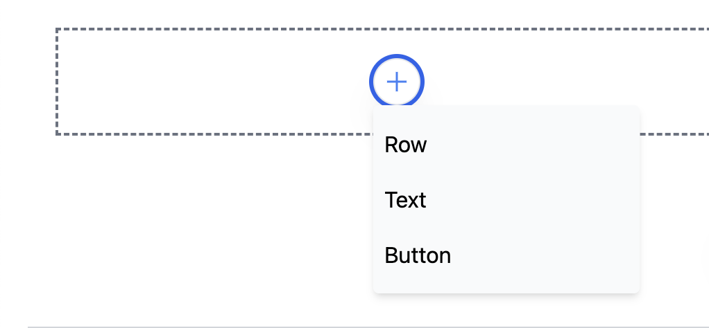

This plugin expands the editor's capabilities to display and add blocks.

## Installation

```sh
npm i @chamaeleon/plugin-add-block-menu
```

## Usage

```ts
import { AddBlockMenu } from '@chamaeleon/plugin-add-block-menu';

const editor = new Editor({
  plugins: [AddBlockMenu()],
});
```



Specifically, this plugin intercept a special transaction with a meta tag - intention, which means that the user calls a certain function, like <a href="https://github.com/lFandoriNl/chamaeleon/blob/master/packages/plugin-add-block-menu/src/add-block-menu.tsx#L36" target="_blank">this</a>
