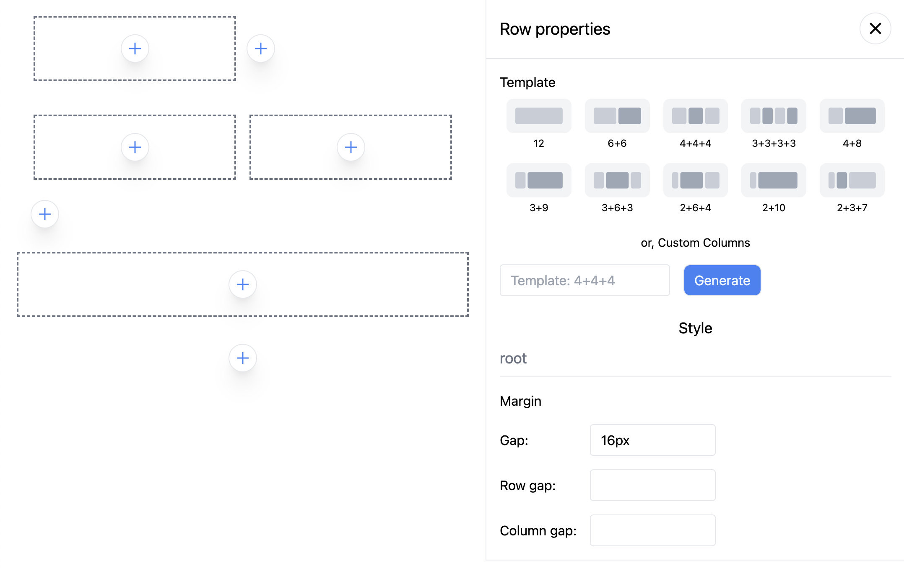

This plugin expands the editor's capabilities to display and add blocks.

## Installation

```sh
npm i @chamaeleon/plugin-configuration-drawer
```

## Usage

```ts
import { ConfigurationDrawer } from '@chamaeleon/plugin-configuration-drawer';

const editor = new Editor({
  plugins: [ConfigurationDrawer()],
});
```



Specifically, this plugin intercept a special transaction with a meta tag - intention, which means that the user calls a certain function, like <a href="https://github.com/lFandoriNl/chamaeleon/blob/master/packages/plugin-configuration-drawer/src/configuration-drawer.tsx#L32" target="_blank">this</a>

`ConfigurationDrawer` requires additional settings; it needs to be passed a node where it will be rendered using ReactPortal

Node can be passed when passing the plugin to the editor

```ts
const editor = new Editor({
  plugins: [
    ConfigurationDrawer({
      element: document.body,
    }),
  ],
});
```

Don't worry if you don't have a link to your node when creating the editor instance, you can configure the driver at any time while the application is running to change the rendering location

```ts
const Example = () => {
  const drawerRef = useRef<HTMLDivElement>(null);

  useEffect(() => {
    if (drawerRef.current) {
      editor.setPluginState(ConfigurationDrawer(), (prev) => ({
        ...prev,
        element: drawerRef.current!,
      }));
    }
  }, []);

  return (
    <div>
      <EditorContent editor={editor} />

      <div ref={drawerRef} />
    </div>
  )
};
```
