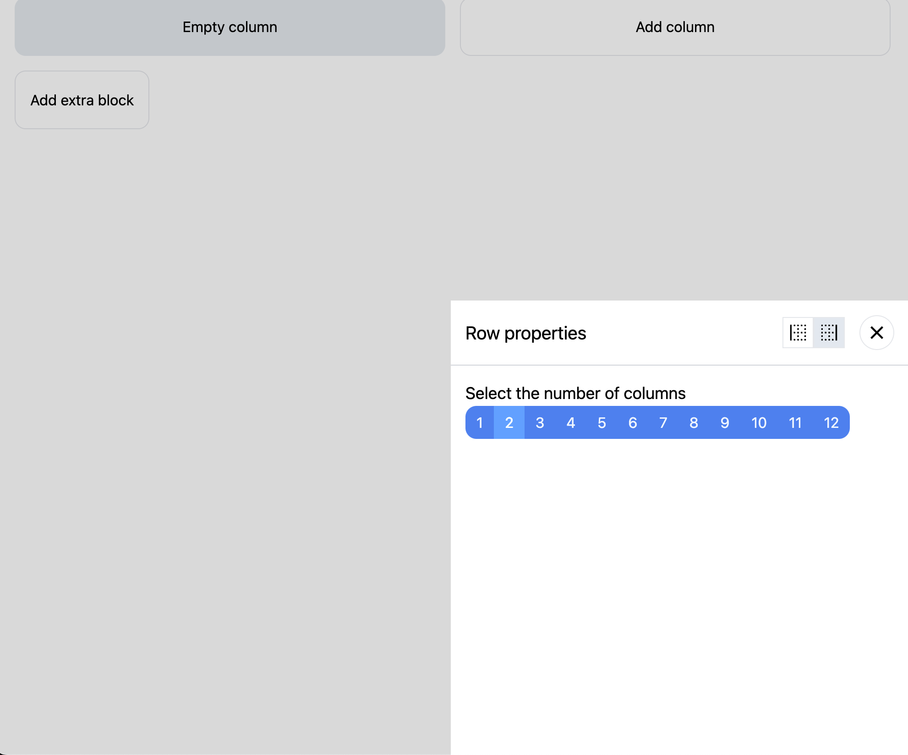

# Example

[Go back](../../README.md#example)

## Base

Creating a Basic Editor Instance

```ts
import { Editor } from '@chamaeleon/core';
import {
  EditorContent,
  EditorProvider,
  useEditor,
} from '@chamaeleon/react-editor';

const editor = new Editor();

const Content = () => {
  const editor = useEditor();

  return <EditorContent editor={editor} />;
};

const Example = () => {
  return (
    <EditorProvider value={editor}>
      <Content />
    </EditorProvider>
  );
};
```

This is the most minimal set. By default, the chameleon has only basic capabilities. To expand their number you need to provide him with plugins.

By default there are no blocks in chameleon, you can install basic plugins to get started.

This happens by passing plugins to editor options.

```ts
import { Page } from '@chamaeleon/plugin-page';
import { Row, Column } from '@chamaeleon/plugin-grid';

const editor = new Editor({
  plugins: [Page(), Row(), Column()],
});
```

Blocks alone will not be enough; you will also need pop-up menus for adding new blocks and configuration menus where you can change block parameters. You can also add them.

```ts
import { AddBlockMenu } from '@chamaeleon/plugin-add-block-menu';
import { ConfigurationDrawer } from '@chamaeleon/plugin-configuration-drawer';

const editor = new Editor({
  plugins: [AddBlockMenu(), ConfigurationDrawer()],
});
```

In this example, `AddBlockMenu` - expands the editor's capabilities to display and add blocks, as shown in the figure


And the `ConfigurationDrawer` provides a drawer where the settings for the active block are rendered



Specifically, these plugins intercept a special transaction with a meta tag - intention, which means that the user calls a certain function, like [this](../../packages/plugin-configuration-drawer/src/configuration-drawer.tsx#L56)

`ConfigurationDrawer` requires additional settings; it needs to be passed a node where it will be rendered using ReactPortal

Node can be passed when passing the plugin to the editor

```ts
const editor = new Editor({
  plugins: [
    ConfigurationDrawer({
      element: document.body,
    }),
  ],
});
```

Don't worry if you don't have a link to your node when creating the editor instance, you can configure the driver at any time while the application is running to change the rendering location

```ts
const Example = () => {
  const drawerRef = useRef<HTMLDivElement>(null);

  useEffect(() => {
    if (drawerRef.current) {
      editor.setPluginState(ConfigurationDrawer(), (prev) => ({
        ...prev,
        element: drawerRef.current!,
      }));
    }
  }, []);

  return (
    <div>
      <EditorContent editor={editor} />

      <div ref={drawerRef} />
    </div>
  )
};
```

## Undo redo commands

```ts
import { History } from '@chamaeleon/plugin-history';

const editor = new Editor({
  plugins: [History()],
});
```

By default, the history limit is 1000 commands, you can configure the plugin to increase or decrease this limit

```ts
import { History } from '@chamaeleon/plugin-history';

const editor = new Editor({
  plugins: [History({ limit: 100 })],
});
```

Usage:

```ts
const Example = () => {
  const editor = useEditor();

  return (
    <>
      <button onClick={() => editor.commands.undo()}>Undo</button>
      <button onClick={() => editor.commands.redo()}>Redo</button>
    </>
  );
};
```

## Persist state

```ts
import { Persist } from '@chamaeleon/plugin-persist';

const editor = new Editor({
  plugins: [Persist()],
});
```

You can pass your own storage and expireIn timestamp to clean up the stale state

```ts
const editor = new Editor({
  plugins: [
    Persist({
      // one hour
      expireIn: 1 * 60 * 60 * 1000,
      storage: myStorage,
    }),
  ],
});
```

You can use the `persist` command to force a save:

```ts
editor.commands.persist();
```

And the `clearPersisted` command to clear the persisted state:

```ts
editor.commands.clearPersisted();
```

## Writing your own plugins

Chamaeleon is primarily a platform for creating ui-builder, because out of the box it provides a small number of blocks, these are a page, a row, a column, a text. During the development process, the basic blocks will be replenished.

Therefore, you will have to create your own plugins to add support for your blocks.

This is what a basic example of a button block might look like:

```tsx
import { Plugin } from '@chamaeleon/core';

export function Button(): Plugin {
  return {
    name: 'button',
    apply(editor, { addBlock }) {
      addBlock({
        name: 'button',
        props: {
          content: {
            default: 'Button',
          },
        },
        style: {
          root: {
            margin: 0,
          },
        },
        components: {
          view: ({ block }) => {
            return (
              <button
                className="rounded bg-blue-500 px-4 py-2 text-white hover:bg-blue-600"
                style={block.style.root}
              >
                {block.props.value}
              </button>
            );
          },
          editor: ({ block }) => {
            return (
              <button
                className="rounded bg-blue-500 px-4 py-2 text-white hover:bg-blue-600"
                style={block.style.root}
              >
                {block.props.value}
              </button>
            );
          },
          palette: () => {
            return <div>Button</div>;
          },
        },
      });
    },
  };
}
```

We create a function that returns the plugin type, more details about each property:

- `name` - the name of our plugin, please note that this name must be unique for all plugins that are loaded into the editor
- `apply` - called immediately before using the plugin
  - the function takes two arguments, the first is the instance of the editor itself, and the second is a set of methods with which you can expand the editor with your own blocks/components to change props or styles etc.
  - to add a new block we use the `addBlock` function, where we pass the following parameters
    - `name` - the name of our block, must be unique
    - `props` - this object describes the parameters of our block; they can be changed in the property editor
    - `style` - this object, by analogy with parameters, describes the styles of the component, styles can be divided into layers, but the main `root` layer must always be defined
    - `components` - set of different block display options
      - `view` component for display by the editor in `view mode`
      - `editor` component for display by the editor in `edit mode`
      - `palette` for rendering a component selection from a `palette`

Now the view and editor components are similar to each other, this is because in edit mode we do not change our button in any way.

For example, if we wanted a popover to be displayed when we hover a button to open the properties editing panel, we could already make the following changes:

```ts
editor: ({ block }) => {
  const { ui } = editor.view;

  const referenceRef = useRef<HTMLButtonElement>(null);

  return (
    <>
      <button
        ref={referenceRef}
        className="rounded bg-blue-500 px-4 py-2 text-white hover:bg-blue-600"
        style={block.style.root}
      >
        {block.props.value}
      </button>

      <ui.ActionPopover referenceRef={referenceRef} placement="top-end">
        <ui.ActionSettingsButton
          onClick={(event) => {
            editor.commands.intention(
              block.id,
              'change-properties',
              event.nativeEvent,
            );
          }}
        />
      </ui.ActionPopover>
    </>
  );
};
```

Here we get a ui object from our `editor.view`, this is the internal components of the editor for buttons/popovers, so using `ui.ActionPopover` we add a hover popover to our button that displays a button for settings at the top right
`ui.ActionSettingsButton`.

When you click on the button, a service command of the editor is called which reports that there is an intention to change the parameters of the component, this command is listened to by another plugin that intercepts it and opens these settings.

When our plugin is ready, we just need to connect it to our editor:

```ts
const editor = new Editor({
  plugins: [
    // other plugins
    Button(),
  ],
});
```

## Overriding editor UI components
