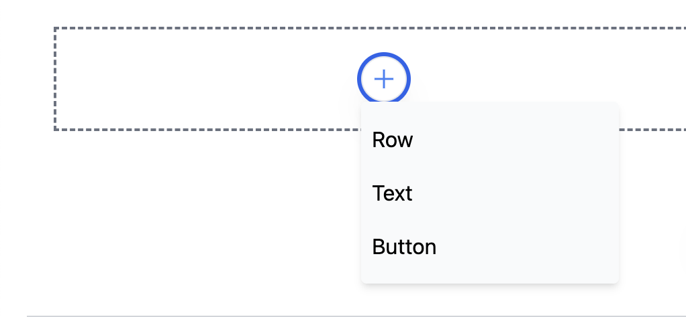

# Example

[Go back](../../README.md#example)

## Base

Creating a Basic Editor Instance

```ts
import { Editor } from '@chamaeleon/core';
import {
  EditorContent,
  EditorProvider,
  useEditor,
} from '@chamaeleon/react-editor';

const editor = new Editor();

const Content = () => {
  const editor = useEditor();

  return <EditorContent editor={editor} />;
};

const Example = () => {
  return (
    <EditorProvider value={editor}>
      <Content />
    </EditorProvider>
  );
};
```

This is the most minimal set. By default, the chameleon has only basic capabilities. To expand their number you need to provide him with extensions.

This happens by passing extensions to editor options.

```ts
import { AddBlockMenu } from '@chamaeleon/extension-add-block-menu';
import { ConfigurationDrawer } from '@chamaeleon/extension-configuration-drawer';

const editor = new Editor({
  extensions: [AddBlockMenu, ConfigurationDrawer],
});
```

In this example, AddBlockMenu - expands the editor's capabilities to display and add blocks, as shown in the figure



And the ConfigurationDrawer provides a drawer where the settings for the active block are rendered


Specifically, these extensions intercept a special transaction with a meta tag - intention, which means that the user calls a certain function, like [this](../../packages/extension-configuration-drawer/src/configuration-drawer.tsx#L56)

## Overriding editor UI components

## Writing your own extensions

## Writing your own plugins
